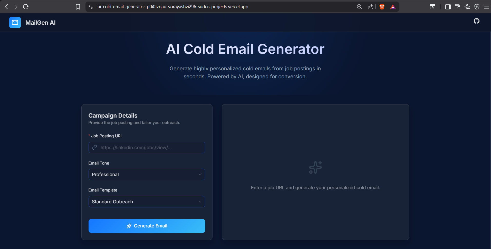
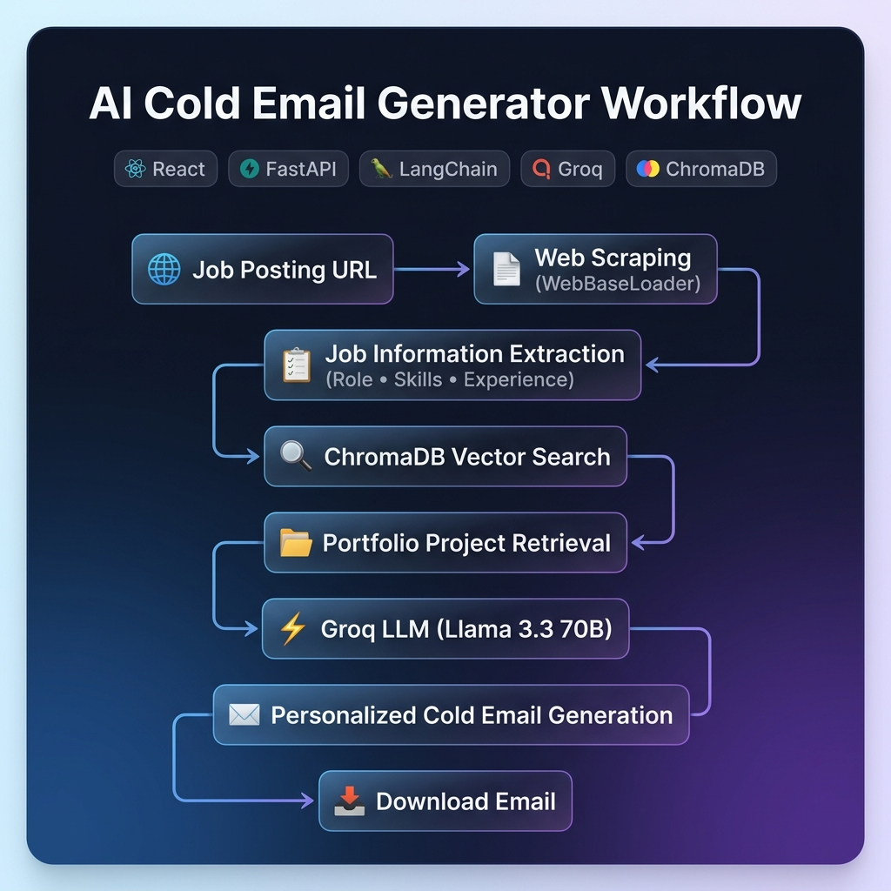
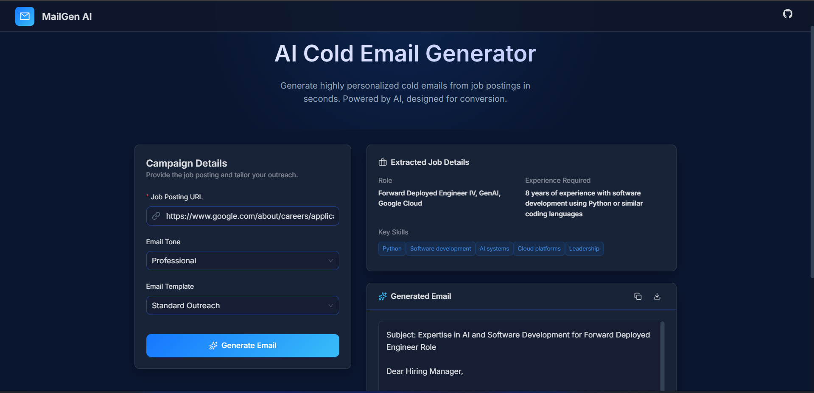

# 🚀 AI Cold Email Generator

Turn job postings into winning cold emails in one click.

An AI-powered application that extracts job details from career pages, matches relevant portfolio projects using vector search, and generates personalized cold emails instantly using LangChain, Groq, and ChromaDB.

---

## 🌐 Live Demo

🔗 Frontend: https://ai-cold-email-generator-p0i0fzqau-vorayashvi296-sudos-projects.vercel.app/

🔗 Backend API: https://ai-cold-email-generator-sg56.onrender.com/

---

## 📸 Screenshots

### 🏠 Home Page


### ⚙️ Workflow


### 📋 Job Details Extraction


### 📧 Generated Email


## ✨ Features

- Extract job details directly from job posting URLs
- AI-powered job description analysis
- Automatic skill extraction
- Smart portfolio matching using ChromaDB
- Personalized cold email generation
- Multiple email tones (Professional, Friendly, Salesy)
- Multiple outreach templates
- Responsive modern UI
- Download generated emails instantly
- Fast responses powered by Groq LLMs

---

## 🛠️ Tech Stack

### Frontend
- React
- Vite
- JavaScript
- CSS

### Backend
- FastAPI
- Python
- LangChain
- Groq
- ChromaDB
- Pandas

### Deployment
- Vercel
- Render

---

## 🧠 How It Works

1. Paste a job posting URL.
2. The application extracts job information.
3. AI identifies skills, experience, and requirements.
4. ChromaDB finds relevant portfolio projects.
5. Groq generates a personalized cold email.
6. Download and use the generated email.

---

## 📂 Project Structure

```text
ai-cold-email-generator/
│
├── backend/
│   ├── main.py
│   ├── chains.py
│   ├── portfolio.py
│   ├── my_portfolio.csv
│   ├── requirements.txt
│
├── frontend/
│   ├── public/
│   ├── src/
│   ├── index.html
│   ├── package.json
│   ├── package-lock.json
│   ├── vite.config.js
│   └── eslint.config.js
│
├── README.md
└── runtime.txt
```

---

## 🚀 Local Setup

### Backend

```bash
cd backend
pip install -r requirements.txt
uvicorn main:app --reload
```

Create a `.env` file:

```env
GROQ_API_KEY=your_groq_api_key
```

---

### Frontend

```bash
cd frontend
npm install
npm run dev
```

Create a `.env` file:

```env
VITE_API_URL=http://localhost:8000
```

---

## 🎯 Use Cases

- Freelancers
- Agencies
- Consultants
- Startup Founders
- Business Development Teams
- Sales Professionals

---

## 🔮 Future Improvements

- Email history
- CRM integrations
- LinkedIn integration
- Additional email templates
- Multi-language support

---

## 👩‍💻 Author

**Yashvi Vora**

GitHub: https://github.com/Yashvi2912

LinkedIn: www.linkedin.com/in/yashvi-vora-ai

---

⭐ If you found this project useful, consider giving it a star on GitHub.
